# ARCHITECTURE.md — ShaderLab-WebGPU 考古分析

> 生成时间：2026-07-19
> 代码考古学家报告 —— 模块依赖 / 核心抽象 / Demo 清单 / 跨 Demo 耦合 / 合并风险评估

---

## 1. 模块依赖图（Mermaid）

```mermaid
graph TD
    subgraph DEMO_LAYER["🎬 Demo Layer（纯 JSON + 私用资源）"]
        D1["demo1<br/>PBR+Physics+Particles+PostFX"]
        D2["demo2<br/>PBR+Physics+Particles+CubeStack"]
        D3["demo3_shadow<br/>ShadowMap+PBR+orbit.js"]
        D4["demo4_spriteSheet<br/>SpriteSheet+Animation"]
        D5["demo5_deferred<br/>Deferred+PhysxBalls+orbit.js"]
        D6["demo6_3dgsViewer<br/>3DGS+orbit.js"]
        D7["demo7_multiView<br/>MultiView+ShadowMap"]
        D8["demo8_customSystem<br/>Orbit component/system"]
    end

    subgraph PLUGIN_LAYER["🔌 Plugin Layer（运行时装载 TS/JS）"]
        PLG_CORE["core<br/>InputSystem / ScriptSystem / CameraSystem<br/>LightSystem / AnimationSystem / render<br/>+12 JSON 声明 + 12 管线 + 13 布局"]
        PLG_PHYS["physics<br/>PhysicsSystem + PickTool<br/>Rapier3D WASM"]
        PLG_PART["particles<br/>ParticleManager<br/>Compute+Draw 管线"]
        PLG_SPLAT["splat<br/>GaussianSplatManager<br/>GsComponent + splat.draw"]
        PLG_ORBIT["orbit<br/>OrbitSystem<br/>OrbitComponent"]
    end

    subgraph ENGINE_LAYER["⚙️ Engine Layer（src/ —— 零插件知识）"]
        subgraph HOST["Host"]
            MAIN["main.ts → Engine"]
            ENGINE["Engine.ts<br/>GPU init / 插件装卸 / app 装卸<br/>帧循环 / attachments / loadGltf"]
        end
        subgraph ECS["ECS"]
            SCENE["Scene (bitecs World)"]
            SCHEMA["SchemaRegistry<br/>SoA 组件 Schema"]
            SYSREG["SystemRegistry<br/>System 名→实例"]
        end
        subgraph RENDER["Render"]
            RG["RenderGraph<br/>相位调度 + pass 合并"]
            PD["PipelineDriver<br/>声明式 draw"]
            PL["PipelineLoader<br/>管线编译 + 虚拟管线"]
            RM["ResourceManager<br/>GPU Buffer/Texture/Mesh"]
            UL["UniformLayout (std140)"]
            BR["BufferRegistry<br/>UBO/SSBO 分配"]
            VR["valueResolver<br/>Mini-DSL 值解析"]
            VS["vertexSlots (SoA slot)"]
            PB["phaseBehaviors (3 默认)"]
        end
        subgraph INFRA["Infra"]
            PM["PluginManager<br/>fetch→sucrase→lexer→Blob import"]
            TS["ToolSystem + TOOL_REGISTRY"]
            EB["EventBus + EVENT_TYPES"]
            API["api.ts<br/>@shaderlab/api 唯一公开面"]
        end
    end

    subgraph COMPOSITION["📋 Composition Layer（纯 JSON 配置）"]
        EC["engine-config.json<br/>pluginsRoot / 引擎级 plugins"]
        SYS_JSON["systems.json<br/>帧系统顺序表"]
        GLTF_MAP["gltf-mapping.json"]
        TXT["textures/ (共享资产)"]
    end

    D1 --> EC
    D2 --> EC
    D3 --> EC
    D4 --> EC
    D5 --> EC
    D6 --> EC
    D7 --> EC
    D8 --> EC

    D6 --> PLG_SPLAT
    D8 --> PLG_ORBIT
    D1 --> PLG_CORE
    D2 --> PLG_CORE
    D3 --> PLG_CORE
    D4 --> PLG_CORE
    D5 --> PLG_CORE
    D6 --> PLG_CORE
    D7 --> PLG_CORE
    D8 --> PLG_CORE

    EC --> PLG_CORE
    EC --> PLG_PHYS
    EC --> PLG_PART

    PLG_CORE --> API
    PLG_PHYS --> API
    PLG_PART --> API
    PLG_SPLAT --> API
    PLG_ORBIT --> API

    API --> ENGINE
    API --> SCENE
    API --> SCHEMA
    API --> SYSREG
    API --> RG
    API --> PD
    API --> PL
    API --> RM
    API --> UL
    API --> BR
    API --> VR
    API --> VS
    API --> PM
    API --> TS
    API --> EB
```



---

## 2. 核心抽象清单 & 稳定性评级

### 2.1 类 / 接口一览

| 抽象 | 位置 | 类型 | 稳定性 | 说明 |
|------|------|------|--------|------|
| `Engine` | `src/Engine.ts:81` | class | **稳定** | 宿主：GPU 初始化、插件/app 编排、帧循环。不包含任何图形/物理/粒子知识。 |
| `EnginePlugin` | `src/plugins/Plugin.ts:12` | abstract class | **稳定** | 插件基类。声明字段(components/pipelines/shaders/…) + 生命周期(init/setup/appLoaded/appUnloading/teardown)。所有插件必须继承。 |
| `PluginContext` | `src/plugins/Plugin.ts:33` | interface | **稳定** | 插件沙箱面：registerSystem/registerAttachment/registerRenderHook/getSystem/getPlugin/replaceRenderer + device/scene/eventBus/baseUrl。 |
| `PluginManager` | `src/plugins/PluginManager.ts:40` | class | **稳定** | 装载链：fetch → sucrase(剥TS类型) → es-module-lexer(重写import) → Blob import → 拓扑排序 → init/applyDecls/setup → teardown/sweep。 |
| `Scene` | `src/ecs/Scene.ts:13` | class | **稳定** | bitecs World 封装。createEntity/clear/getField/setField/toJSON + 摄像机列表 + 模型矩阵。 |
| `SchemaRegistry` | `src/ecs/SchemaRegistry.ts:9` | class | **稳定** | SoA 组件 Schema 注册中心。ComponentDef→bitecs defineComponent。字段展开(vec3→_x/_y/_z)、字符串表。Owner-tracked。 |
| `System` | `src/ecs/SystemRegistry.ts:14` | interface | **稳定** | `{ update(ctx: FrameContext): void; dispose?(): void }` —— 唯一系统契约。 |
| `FrameContext` | `src/ecs/SystemRegistry.ts:20` | interface | **稳定** | 帧上下文：scene/time/dt/aspect/cw/ch/device/eventBus/attachments/getSystem/getBuffer/writeBuffer/dispatchCompute。 |
| `SystemRegistry` | `src/ecs/SystemRegistry.ts:55` | class | **稳定** | System 名→实例解析器。builtins Map + defs Map + 脚本系统加载。Owner-tracked。 |
| `RenderGraph` | `src/render/RenderGraph.ts:47` | class | **稳定** | 数据驱动渲染图。相位调度 → PhaseBehavior 查表 → perCamera/非perCamera 分支 → 默认 normal 行为合并 pass。实现 `IRenderer + System`。 |
| `PipelineDriver` | `src/render/PipelineDriver.ts:42` | class | **稳定** | 声明式 draw：query entities → resolve bind groups via valueResolver → execute geometry steps / call hook。 |
| `PipelineLoader` | `src/render/PipelineLoader.ts:51` | static class | **稳定** | 管线编译：WGSL 编译 → GPUVertexBufferLayout → GPURenderPipeline/GPUComputePipeline。支持 `'<plugin>:path'` 虚拟引用和内存声明。 |
| `ResourceManager` | `src/render/ResourceManager.ts:37` | class | **稳定** | GPU 资源总管：mesh→GPU buffer、texture 上传、color/depth target、handle table。Per-app exitApp 清理。 |
| `IRenderer` | `src/render/types.ts:169` | interface | **稳定** | 渲染器缝：update/compile/fromData/toData/exitApp/registerPhaseBehavior。Plugin 可 replaceRenderer。 |
| `PhaseBehavior` | `src/render/types.ts:188` | interface | **稳定** | 相位策略：perCamera? + run(ctx: PhaseBehaviorContext)。引擎默认 3 个：normal/shadow-clear/postprocess-chain。 |
| `UniformLayout` | `src/render/UniformLayout.ts:7` | class | **稳定** | std140 布局计算器：byte offset / float offset / total size。12 种 WGSL 类型。 |
| `BufferRegistry` | `src/render/BufferRegistry.ts:17` | class | **稳定** | System 声明 UBO/SSBO → GPU 分配。common/app scope。 |
| `EventBus` | `src/events/EventBus.ts:1` | class | **稳定** | 简单 pub/sub：on(type, handler)→unsubscribe / emit(type, payload?) / clear()。 |
| `ToolSystem` | `src/tools/ToolSystem.ts:5` | class | **稳定** | 工具加载：type(工厂查表) / source(Blob import) → SceneTool.attach。 |
| `GltfLoader` | `src/gltf/GltfLoader.ts` | class | **稳定** | glTF → ECS entities。通过 gltf-mapping.json 映射 component。 |

### 2.2 模块级单例（全局状态）

| 单例 | 位置 | 用途 | Owner 清理 |
|------|------|------|------------|
| `schemaRegistry` | `src/ecs/SchemaRegistry.ts:263` | 组件 Schema 注册 | 是 |
| `systemRegistry` | `src/ecs/SystemRegistry.ts:306` | System 名→实例解析 | 是 |
| `resourceManager` | `src/render/ResourceManager.ts:1011` | GPU 资源管理 | 是 (exitApp) |
| `bufferRegistry` | `src/render/BufferRegistry.ts:142` | UBO/SSBO 分配 | 是 (exitApp) |
| `uniformLayouts` | `src/render/UniformLayout.ts:137` | std140 布局注册 | 是 |
| `pluginManager` | `src/plugins/PluginManager.ts:238` | 插件装载/卸载 | 是 |
| `atomNamespaces` | `src/render/valueResolver.ts:25` | 值解析原子函数 | 是 |
| `VERTEX_SLOTS` / `SLOT_ORDER` | `src/render/vertexSlots.ts:12` | SoA 顶点槽位 | 是 |
| `meshGenerators` | `src/render/Primitives.ts:310` | 程序化网格生成器 | 是 |
| `TOOL_REGISTRY` | `src/tools/ToolSystem.ts:9` | 工具工厂注册 | 否(通过 Engine ledger) |
| `PipelineLoader` (static) | `src/render/PipelineLoader.ts` | 管线/着色器缓存 | 是 (removeVirtualsByPrefix) |

### 2.3 Demo 特有的非稳定抽象

| 抽象 | 位置 | 说明 |
|------|------|------|
| `OrbitComponent` | `public/plugins/orbit/index.ts` | demo8 用。半径/速度/自旋参数。Plugin 级声明。 |
| `OrbitSystem` | `public/plugins/orbit/OrbitSystem.ts` | demo8 用。读 OrbitComponent → 写 Transform。Plugin 级。 |
| `GsComponent` | `public/plugins/splat/index.ts` | demo6 用。PLY 路径 + count。Plugin 级声明。 |
| `GaussianSplatManager` | `public/plugins/splat/GaussianSplatManager.ts` | demo6 用。GPU sort + splat render。单实例限制。 |
| `SpriteSheetComponent` / `SpriteAnimationComponent` | `public/apps/demo2/components.json` & `public/apps/demo4_spriteSheet/components.json` | App 级组件声明。未插件化。 |
| `GameStateComponent` | `public/apps/demo2/components.json` | demo2 独有。游戏状态(ballSpeed/ballRadius/spawnHeight)。 |
| `OrbitCameraController` (脚本) | `demo3_shadow/scripts/orbit.js` 等 5 个文件 | 粘贴复制。无插件化。与 orbit plugin 两套路线。 |

---

## 3. 每个 Demo 的系统清单

### 3.1 demo1（PBR + Physics + Particles + PostFX）

**插件**: `["core", "physics", "particles"]`（引擎级）
**系统顺序** (`common/systems.json`):
```
input → script → physics → camera → light → animation → render
```

**GPU 资源**:
- **管线**: Grid, TestMesh, PbrSolid, TestEdge, TestPoint, PhysicsDebug (Opaque); Particles (Transparent); Skybox; Tint/Invert/Greyscale (Postprocess, 默认 disabled)
- **渲染目标**: `scene`, `sceneDepth`, `shadow2D`, `shadowPoint`, `ppA`, `ppB`
- **姿态**: `"normal"` (per-camera, merge by target), `"postprocess-chain"` (全屏 ping-pong)
- **UBO**: camera, light, timeInput, perEntity, pbrObject (common scope)
- **glTF**: `DamagedHelmet.glb` → Transform + MeshComponent + PbrMaterial entities

### 3.2 demo2（CubeStack + Game Script）

**插件**: `["core", "physics", "particles"]`（引擎级）
**系统顺序** (`common/systems.json`):
```
input → script → physics → camera → light → animation → render
```

**GPU 资源**:
- **管线**: Grid, TestMesh, TestEdge, PhysicsDebug(disabled) (Opaque); Sparks (Transparent); Skybox
- **渲染目标**: `scene`, `sceneDepth`
- **App 组件**: `GameStateComponent`(components.json) + `SpriteSheetComponent`/`SpriteAnimationComponent`
- **脚本**: `scripts/game.js`（球生成、碰撞火花）

### 3.3 demo3_shadow（Shadow Mapping）

**插件**: `["core", "physics", "particles"]`（引擎级）
**系统顺序** (`common/systems.json`):
```
input → script → physics → camera → light → animation → render
```

**GPU 资源**:
- **管线**: ShadowMap (Shadow 相位, `"shadow-clear"` behavior); PbrSolid + ShadowDebug(disabled) (Opaque)
- **App 自有管线**: `pipelines/ShadowDebugPipeline.json` + `shaders/ShadowDebug.wgsl`
- **渲染目标**: `scene`, `sceneDepth`, `shadow2D`, `shadowPoint`
- **脚本**: `scripts/orbit.js`（OrbitCameraController 脚本版）
- **glTF**: `DamagedHelmet.glb`

### 3.4 demo4_spriteSheet（Sprite Sheet Animation）

**插件**: `["core", "physics", "particles"]`（引擎级）
**系统顺序** (`common/systems.json`):
```
input → script → physics → camera → light → animation → render
```

**GPU 资源**:
- **管线**: Sprites (Transparent)
- **渲染目标**: `scene`, `sceneDepth`
- **App 组件**: `SpriteSheetComponent`, `SpriteAnimationComponent`(components.json)
- **App 资产**: `sheets/spritesheet.json`, `textures/spritesheet.webp`
- **脚本**: `scripts/director.js`

### 3.5 demo5_deferred（Deferred Rendering + Physics Balls）

**插件**: `["core", "physics", "particles"]`（引擎级）
**系统顺序** (`common/systems.json`):
```
input → script → physics → camera → light → animation → render
```

**GPU 资源**:
- **管线**: ShadowMap (Shadow); GBuffer (GBuffer); DeferredLight + Grid + PhysicsDebug (Opaque)
- **App 自有管线**: `pipelines/GBufferPipeline.json` + `pipelines/DeferredLightPipeline.json`
- **App 自有着色器**: `shaders/GBuffer.wgsl` + `shaders/DeferredLight.wgsl`
- **渲染目标**: `scene`, `sceneDepth`, `shadow2D`, `shadowPoint`, `gbufferA/B/C/D`
- **脚本**: `scripts/orbit.js`(与 demo3 完全相同), `scripts/director.js`
- **注意**: GBuffer → DeferredLight 是 app 内紧耦合，必须同 phase 顺序配合

### 3.6 demo6_3dgsViewer（3D Gaussian Splatting）

**插件**: `["core", "physics", "particles"]`（引擎级）+ `["splat"]`（app 级）
**系统顺序** (`apps/demo6_3dgsViewer/systems.json`):
```
input → script → physics → camera → light → animation → gaussianSplat → render
```

**GPU 资源**:
- **管线**: Grid + PbrSolid (Opaque); GaussianSplat (Transparent, app 自有)
- **App 自有管线**: `pipelines/GaussianSplatPipeline.json` + `shaders/GaussianSplat.wgsl`
- **渲染目标**: `scene`, `sceneDepth`
- **Hook**: `splat.draw` (geometry hook, splat 插件注册)
- **Attachment**: `splats`
- **脚本**: `scripts/orbit.js`(变体版，不同常量)
- **glTF**: `bicycle-road.ply` (经 GsComponent.ply 字段指定)

### 3.7 demo7_multiView（Multi-View Split Screen）

**插件**: `["core", "physics", "particles"]`（引擎级）
**系统顺序** (`common/systems.json`):
```
input → script → physics → camera → light → animation → render
```

**GPU 资源**:
- **管线**: ShadowMap (Shadow); PbrSolid (Opaque)
- **渲染目标**: `scene`, `sceneDepth`, `shadow2D`, `shadowPoint`
- **RenderGraph**: `multiView: true`
- **双摄像机**: LeftCamera (viewport [0,0,0.5,1]) + RightCamera (viewport [0.5,0,0.5,1])
- **脚本**: `scripts/orbitLeft.js` + `scripts/orbitRight.js`（各自半屏 filter）
- **glTF**: `DamagedHelmet.glb`

### 3.8 demo8_customSystem（Custom Orbit System Plugin）

**插件**: `["core", "physics", "particles"]`（引擎级）+ `["orbit"]`（app 级）
**系统顺序** (`apps/demo8_customSystem/systems.json`):
```
input → script → physics → camera → light → animation → orbit → render
```

**GPU 资源**:
- **管线**: PbrSolid (Opaque)
- **渲染目标**: `scene`, `sceneDepth`
- **System**: `orbit`（OrbitSystem。读 OrbitComponent → 写 Transform。使用 orbitScratch SSBO）
- **插件组件**: `OrbitComponent`(radius/speed/spin)

---

## 4. 跨 Demo 引用 & 隐式全局状态

### 4.1 跨 Demo 引用矩阵

| 引用类型 | demo1 | demo2 | demo3 | demo4 | demo5 | demo6 | demo7 | demo8 |
|----------|-------|-------|-------|-------|-------|-------|-------|-------|
| 引用其他 demo 目录 | - | - | - | - | - | - | - | - |
| 共享外部资产 (../../assets/) | H | - | H | - | - | P | H | - |
| 粘贴复制 orbit.js | - | - | A | - | A(same) | B(variant) | C×2(variant) | - |
| App 级管线/着色器 | - | - | S | S | S | S | - | - |
| App 级插件 | - | - | - | - | - | splat | - | orbit |

> H = DamagedHelmet.glb, P = bicycle-road.ply, A/B/C = orbit.js 不同变体, S = Self-contained

### 4.2 隐式全局状态风险

| 风险项 | 详情 | 风险等级 |
|--------|------|----------|
| **模块级单例** (15个) | 所有注册中心(schemaRegistry/systemRegistry/resourceManager/bufferRegistry/uniformLayouts/atomNamespaces/VERTEX_SLOTS/meshGenerators/PipelineLoader.static)是模块级单例。App 切换时通过 owner-tag 清理 app 级资源，但 common/plugin 级资源常驻。 | 中 |
| **PipelineLoader 静态缓存** | `virtualConfigs/virtualShaders/configs/computeMeta/pipelineSlots/shaderModules` 全部 static。插件卸载时按前缀清理，但不同 app 的同一插件复用同一缓存——通常有意为之。 | 低 |
| **orbit.js 副本** (5个) | demo3/demo5/demo6/demo7 各自携一份 orbit camera 脚本，内容高度相似但常量略有不同。如果某 demo 的 orbit.js 有 bug，不会影响其他 demo。但"合并运行"时无法共用同一 orbit 控制器。 | 中 |
| **app.json 无版本/约束** | 无插件版本号、无显式能力需求声明。虽然 `meta.dependencies` 有拓扑排序，但只是 Plugin ID 列表，无 semver。 | 低 |
| **GaussianSplat 单实例限制** | `GaussianSplatManager` 代码注释中明确"多 GsComponent 用最后一个并 warn"。 | 低 |
| **ResourceManager exitApp 不清理 Plugin 级** | `exitApp` 只清 `app:<id>` 和 `currentOwner` 下的资源。Plugin 级资源 (`plugin:<id>`) 仅在插件卸载时清理。引擎级插件(core/physics/particles)永不卸载，其资源常驻。 | 低 |

### 4.3 设计耦合 vs 问题耦合

| 类型 | 说明 | 判定 |
|------|------|------|
| 所有 demo 依赖 core/physics/particles 插件 | 引擎级常驻插件。`engine-config.json` `plugins: ["core","physics","particles"]`。 | 设计耦合 |
| 所有 demo 依赖 `common/systems.json` 顺序 | 默认帧系统顺序。demo6/demo8 各自 override。 | 设计耦合 |
| Pipeline 共享走 `<plugin>:pipelines/*` | 正确解耦：插件是能力提供者，demo 是能力消费者。 | 设计耦合 |
| orbit.js 五副本 | 粘贴复制，非模块化。与 `orbit` plugin 是两套完全独立的 orbit 机制。 | 问题耦合 |
| demo5 DeferredLight ← GBuffer | App 内 tight coupling，非跨 app。 | 设计耦合 |

---

## 5. 合并 Demo-A 与 Demo-B 运行评估

### 5.1 前提条件（引擎约束）

- 同一时刻只有一个 `active app`——`Engine.unloadCurrentApp()` 在 `loadApp()` 前自动执行。
- App 级插件通过 `app.json.plugins` 声明，app 卸载时逆拓扑 teardown + sweep。
- App 级资源通过 `resourceManager.exitApp(appId)` 清理（mesh/texture/target/buffer）。
- `Scene` 是单例——`scene.clear()` 清除所有 entity。
- **"合并两个 demo 运行"必须选择以下策略之一**：
  - **(A) 新组合 app**：写一个新的 `app.json` + `scene.json` + `render.json`，合并两个 demo 的场景/管线/系统。
  - **(B) 运行时多场景**：修改 Engine 支持多 Scene 实例（当前不支持）。
  - **(C) 合成场景**：将两个 demo 的场景合为一个 scene.json

### 5.2 以 demo1 + demo6 为例——必须修改的文件

假设采用策略 (A)：创建 `demo9_merged` app。

```
需修改/创建的文件:
├── public/apps/demo9_merged/
│   ├── app.json          ★ 新建。plugins: ["splat"]（demo6 用的 app 级插件）
│   ├── systems.json      ★ 新建。合并两个 demo 的系统顺序。
│   │                        input → script → physics → camera → light → animation
│   │                        → gaussianSplat → render
│   ├── scene.json        ★ 新建。合并 demo1 和 demo6 的 entity。
│   │                        - 合并 MainCamera（选一个或双摄像机）
│   │                        - 合并 Environment（选一个）
│   │                        - 合并两个 SunLight（重命名，但两者皆有 directional）
│   │                        ★ 冲突点：demo1 和 demo6 都有 "SunLight" key。
│   │                          需重命名为 "SunLight1"/"SunLight2" 或合并配置。
│   │                        - 合并所有 Physical/Falling objects + GsEntity + Pbr objects
│   │                        - 合并 ParticleSystem/Emitter/ForceField
│   │                        - 合并 PhysicsWorld / PhysicsController（★ 冲突：两个都有）
│   ├── render.json       ★ 新建。合并 render phases。
│   │                        Opaque: Grid + Mesh + PbrSolid + Edge + Point + PhysicsDebug
│   │                        Transparent: Particles + Splat
│   │                        Skybox: Skybox
│   │                        Postprocess: Tint + Invert + Greyscale
│   ├── pipelines/        ★ 可选。如果需 demo6 私用管线：
│   │   └── GaussianSplatPipeline.json  (从 demo6 复制或引用)
│   └── shaders/          ★ 可选。
│       └── GaussianSplat.wgsl  (从 demo6 复制)
```

**零引擎修改**。无需改 `src/` 下任何文件（得益于插件架构）。

### 5.3 需注意的冲突点

| 冲突 | 说明 | 解决方案 |
|------|------|----------|
| **同名 Entity Key** | demo1 和 demo6 都有 `"SunLight"`, `"MainCamera"`, `"Environment"`, `"Cube"` 等 key。Scene.createEntity 用 key 作为唯一标识——同名 entity key 会导致后者覆盖前者。 | 重命名 entity key（如 `"SunLight_D1"` / `"SunLight_D6"`）。 |
| **同光源类型** | 两个 directional light 配不同参数（intensity/shadow）。如果一个 directional 就够了则合并。 | 合并参数或用两个不同名的 directional light。 |
| **PhysicsWorld 冲突** | 两个 demo 的 `PhysicsControllerComponent` 配置不同（groundEnabled/groundHeight）。同一个 world 只能有一个控制器。 | 保留一个，合并参数。 |
| **相机冲突** | 两个 `"MainCamera"` key 冲突。demo6 用 orbit.js 控制，demo1 用静态相机。 | 重命名。也可改用 multiView（见 demo7）。 |
| **GsComponent 单实例限制** | GaussianSplatManager 当前仅支持一个 GsComponent 实例。 | 需修改 splat 插件代码移除该限制。 |
| **orbit.js 冲突** | demo6 用 orbit.js 脚本驱动相机，demo1 用静态相机。如果一个场景中有多个带 ScriptComponent 的相机，可能产生意想不到的交互。 | 明确哪个相机 active。ScriptComponent 独立运作，需确保脚本逻辑不冲突。 |
| **Postprocess chain** | demo1 的 Postprocess 管线(Tint→Invert→Greyscale)使用 render targets `ppA`/`ppB`。如果 3DGS scene 不需要后处理，可保持 disabled。 | 保持 disabled 或启用。无冲突。 |

### 5.4 通用合并策略矩阵

| Demo Pair | 额外需注意 |
|-----------|-----------|
| demo1 + demo2 | 低风险。demo2 的 `components.json` 声明需合并到 app.json。demo2 的 `GameStateComponent` + `scripts/game.js` 是指定 entity 的游戏逻辑，不冲突。 |
| demo1 + demo3 | 低风险。demo3 需 Shadow phase + ShadowMap 管线 + shadow render targets。两者共用 `DamagedHelmet.glb`。demo3 的 orbit.js 是脚本型相机——需决定用哪个相机。 |
| demo1 + demo4 | 中风险。demo4 需 `SpriteSheetComponent`/`SpriteAnimationComponent`（components.json）+ 自有纹理/管线。场景 entity 是唯一冲突源。 |
| demo3 + demo5 | 中风险。两者都有 Shadow phase。demo5 GBuffer→DeferredLight 是 tight coupling。需确保 phase 顺序：Shadow → GBuffer → Opaque。 |
| demo5 + demo6 | 中风险。demo5 的 deferred 管线占用 GBuffer targets，demo6 的 splat 在 Transparent 相——相位不冲突。但 PhysicsWorld 配置冲突需合并。 |
| demo6 + demo8 | 低风险。splat(Transparent) + orbit(Opaque) 不同相位。orbit 是 System 不是脚本，不互斥。GsComponent 单实例限制需注意。 |
| demo7 + any | **高风险**。demo7 的 `multiView: true` + viewport 分割 + 双摄像机 + 双 orbit 脚本。其他 demo 的管线假设单 viewport 绑定。需深入测试。 |

---

## 6. 风险评级总表

| 风险项 | 级别 | 原因 |
|--------|------|------|
| **模块级单例污染** | 中 | 15 个导出 const 单例。App 切换时有 owner-tag 清理保障，但 plugin 级资源常驻。需全量测试确保切换无残留。 |
| **orbit.js 五副本** | 中 | 同一逻辑分散在 5 个文件中。维护成本高，合并时需统一选型（脚本 vs Plugin）。 |
| **GsComponent 单实例** | 低 | 仅影响使用 splat 插件的场景。代码中已明确警告。 |
| **Entity Key 命名冲突** | 中 | Scene 用 entity key 做唯一标识。任何两个 demo 合并都需手动去重 entity key。 |
| **PhysicsWorld 重复** | 中 | 两个 PhysicsControllerComponent 在同一 world 中会导致未定义行为。需手动合并。 |
| **Pipeline 共享纯走 Plugin** | 低 | 架构正确。`<plugin>:pipelines/*` 是标准解耦路径。App 私有管线自包含。 |
| **无插件版本号** | 低 | 无 semver。但 `meta.dependencies` 拓扑排序 + fail-loud 策略有效防止加载失败静默降级。 |
| **multiView 兼容性** | 高 | demo7 是唯一 multiView 测试用例。与其他 demo 的渲染管线(pipeline config 中假设单 viewport)有不兼容风险。 |
| **Render Target 命名冲突** | 低 | ppA/ppB (postprocess) 和 gbufferA/B/C/D (deferred) 名称不冲突。场景目标 scene/sceneDepth/shadow* 统一管理。 |
| **DataRoot 路径假设** | 低 | `engine-config.json` 的 `dataRoot: "/common"` 和 `appsRoot: "/apps"` 统一配置。外部资产 `../../assets/` 路径稳定。 |

---

## 7. 总结

**架构评分**：插件驱动设计良好，三层分离（Engine/Plugin/Composition）清晰，owner-tag 清理机制完整。

**主要债**：
1. orbit.js 五副本——应统一为 `orbit` plugin 或提取为共享脚本模块。
2. 部分 app 级组件(SpriteSheet/SpriteAnimation/GameState)未插件化——仍在 `components.json` 中。
3. 无自动化跨-app 合并测试——每次合并都是手动 entity key 去重 + 参数调谐。

**合并可行性**：任何两个 demo 可在**不修改 src/ 代码**的前提下合并。工作量集中在：写新的 `app.json`/`scene.json`/`render.json` + entity key 去重 + 物理配置合并。api.ts 契约无需变更。
